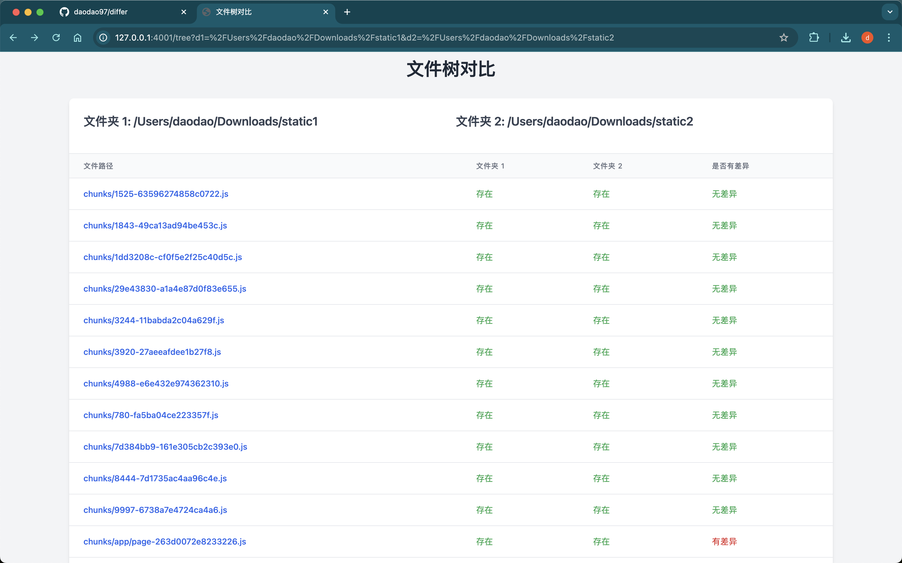
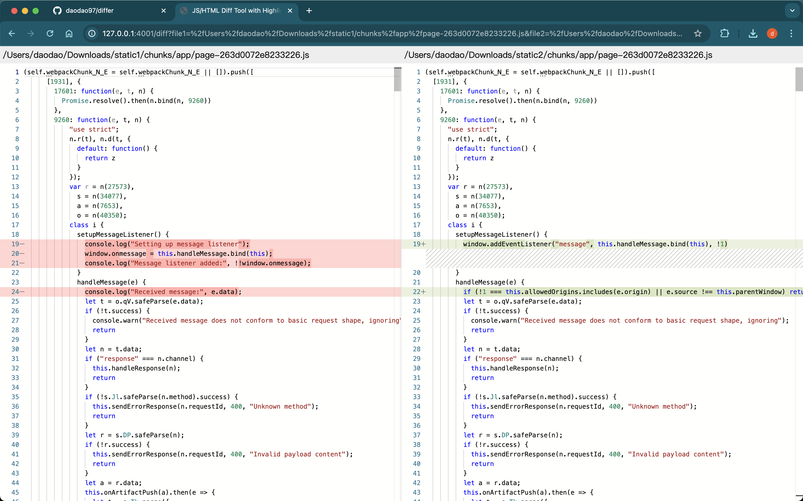

## differ

differ 是一个用于比较两个文件的工具







## install

```bash
go install github.com/daodao97/differ@latest
```

## 使用

```bash
differ
```

open `http://127.0.0.1:4001` in browser

## feature

- auto format decode javascript/html